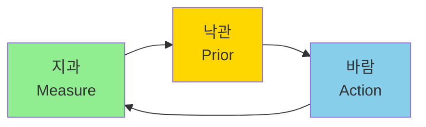

---
up:
  - "[[Home]]"
related:
  - "[[군인]]"
  - "[[학자]]"
  - "[[이슬]]"
created: 2025-01-11
in:
  - "[[Maps]]"
tags:
  - oil-framework
  - bayesian
  - precision-calibration
version: "1.0"
---

> [!map]+ # 🎯 지과-낙관-바람 지도
> 
> **베이지안 순환의 3박자**  
> _Stop → Believe → Act_
> 
> 이순신의 네 전장에서 반복되는 리듬.  
> OIL Framework의 실천 구조.

---

## 🧭 세 가지 박자

### 🛑 지과(止戈) - Measure & Observe

> [!note]- **본질**: 창을 멈추는 것이 진정한 무(武)
> 
> **의미**:
> - 止 (멈출 지) + 戈 (창 과)
> - 전투를 멈추고 관찰하다
> - 베이지안: **Observation phase**
> 
> **실천**:
> - V/4i threshold 측정
> - 현재 상태 파악
> - "멈추고 보라"
> 
> **질문**:
> - 지금 무엇을 관찰하고 있는가?
> - V와 i의 비율은 얼마인가?
> - Precision을 올릴 때인가, 내릴 때인가?

---

### 🌅 낙관(樂觀) - Prior & Belief

> [!note]- **본질**: 즐거운 마음으로 본다
> 
> **의미**:
> - 樂 (즐거울 락) + 觀 (볼 관)
> - 실제보다 긍정적으로 믿는다
> - 베이지안: **Prior belief** with optimism
> 
> **실천**:
> - Strategic ambiguity 설정
> - Vague promise로 시작
> - Adaptive capacity 보존
> 
> **질문**:
> - 내 prior는 무엇인가?
> - Honest ignorance를 signal하는가?
> - 낙관이 과하지 않은가?

---

### 💨 바람(風) - Action & Execute

> [!note]- **본질**: 바람처럼 방향을 정하고 움직인다
> 
> **의미**:
> - 바람처럼 흐른다
> - 때를 알고 움직인다
> - 베이지안: **Posterior action**
> 
> **실천**:
> - Earn precision
> - Commit or pivot
> - √(V/i) calibration
> 
> **질문**:
> - 어느 방향으로 갈 것인가?
> - Commitment할 준비가 되었는가?
> - 타이밍이 맞는가?

---

## 🔄 네 전장에서의 리듬

### 🐢 사천 (What) - 낭만의

```yaml
지과(止戈): "창을 멈추는 것이 진정한 무"
  → 문제의 본질을 묻기 위해 멈춘다
  → What is the problem?

낙관(樂觀): "낭만은 실제보다 긍정적으로 믿는 낙관"
  → 꿈을 꾸고 가능성을 믿는다
  → Prior with optimism

바람(風): "So we beat on, boats against the current"
  → 역류하는 배처럼 나아간다
  → Explore the space
```

---

### 🐅 한산 (Why) - 세련지

```yaml
지과(止戈): "한산섬 달 밝은 밤에, 수루에 홀로 앉아"
  → 고요히 앉아 전략을 세운다
  → Why does it work?

낙관(樂觀): "12개 테마의 합성과 변주"
  → 다양한 낭만이 조화를 이룬다
  → Calibrate multiple priors

바람(風): "유머는 타이밍, 세련됨은 식상하지 않은 것"
  → 타이밍을 맞춰 움직인다
  → Earn precision with style
```

---

### 🐙 명량 (How) - 절절용

```yaml
지과(止戈): "필생즉사 (必生則死)"
  → 죽고자 하면 살고, 살고자 하면 죽는다
  → How to execute?

낙관(樂觀): "잘못된 낭만은 사회악"
  → 현실을 직시한다 (Better Place의 교훈)
  → Correct the prior

바람(風): "절절함, 정서적 물리"
  → 절절히 투쟁한다
  → Fully commit
```

---

### 👾 노량 (So What) - 똘똘현

```yaml
지과(止戈): "찬란하구나, 참으로 눈부시구나"
  → 완성을 바라본다
  → So what did we achieve?

낙관(樂觀): "몰락해도 전설이 될 수 있다는 낙관"
  → 실패도 레거시가 된다
  → Legacy as posterior

바람(風): "이별을 준비하는 시점"
  → 다음을 준비한다
  → Prepare next cycle
```

---

## 📅 12개월 적용

> [!compass]+ ## 월별 지과-낙관-바람
> 
> ### ❄️ 겨울 (노량/똘똘현)
> - **12월**: 지과 - "찬란하구나" - Framework 완성
> - **1월**: 낙관 - "몰락해도 전설" - 새해 낙관
> - **2월**: 바람 - "이별 준비" - Pivot or persist
> 
> ### 🌱 봄 (사천/낭만의)
> - **3월**: 지과 - "창을 멈춤" - What is the problem?
> - **4월**: 낙관 - "긍정적 믿음" - Prior setting
> - **5월**: 바람 - "역류하는 배" - Explore
> 
> ### ☀️ 여름 (한산/세련지)
> - **6월**: 지과 - "달 밝은 밤" - Measure V/4i
> - **7월**: 낙관 - "12개 테마" - Calibrate
> - **8월**: 바람 - "타이밍" - Earn precision
> 
> ### 🍂 가을 (명량/절절용)
> - **9월**: 지과 - "필생즉사" - Commitment decision
> - **10월**: 낙관 - "현실 직시" - Correct prior
> - **11월**: 바람 - "절절함" - Execute fully

---

## 🎯 OIL Framework 연결



### 베이지안 순환

1. **지과 (Observation)**
   - V/4i 측정
   - 현재 precision 파악
   - "멈추고 관찰"

2. **낙관 (Prior)**
   - Strategic ambiguity 설정
   - τ (precision) calibration
   - "믿음을 설정"

3. **바람 (Posterior)**
   - P(H|E) 계산
   - Commit or pivot
   - "행동으로 이동"

---

## 🔗 연결된 노트

**상위 지도**:
- [[Home]]
- [[Maps]]

**전장 지도**:
- [[군인]] - 4전장 흐름
- [[학자]] - 베이지안 창업
- [[이슬]] - 교육과 협력

**실천**:
- [[Calendar/Daily]] - 매일의 적용
- [[Efforts/Ongoing]] - 진행 중인 프로젝트

---

## 💡 매일의 질문

매일 아침 세 가지를 묻는다:

1. **지과**: "오늘 무엇을 관찰할 것인가?"
2. **낙관**: "어떤 믿음으로 시작할 것인가?"
3. **바람**: "어느 방향으로 움직일 것인가?"

---

*"멈추고(止), 믿고(樂), 움직인다(風)."*  
*"Observe, Believe, Act."*  
*"Stop, Prior, Go."*

---

## 📊 Dataview 쿼리

```dataview
TABLE WITHOUT ID
  file.link as "노트",
  지과바람 as "단계",
  전장 as "전장"
WHERE contains(지과바람, "지과") OR contains(지과바람, "낙관") OR contains(지과바람, "바람")
SORT 전장 asc, 지과바람 asc
```
