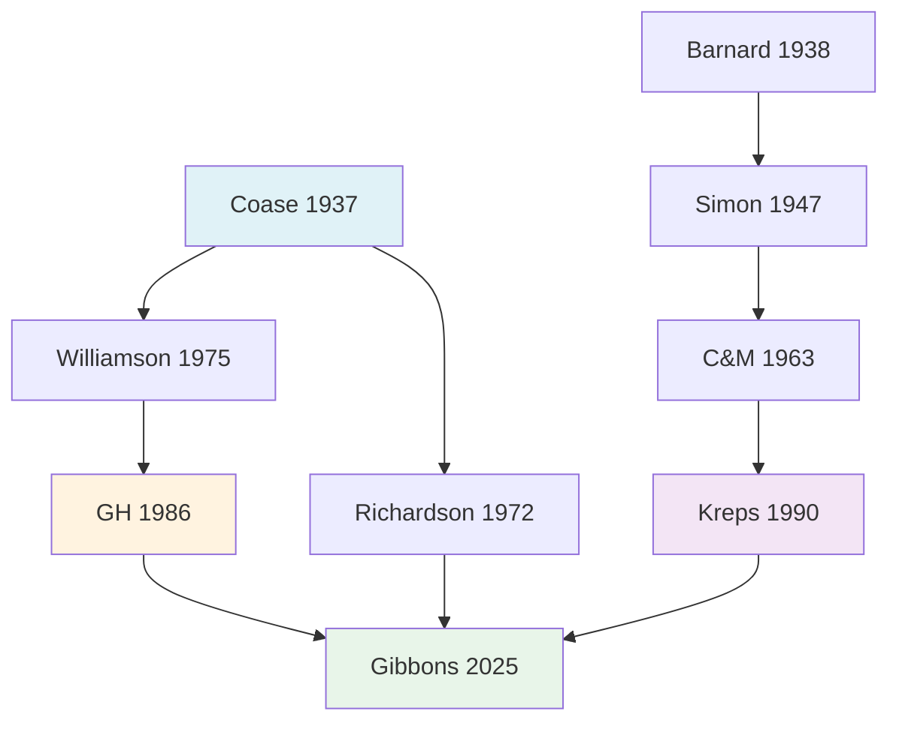

# 📚 Papers Database Index

## Quick Stats
```dataview
TABLE 
  authors as "Authors",
  year as "Year",
  field as "Field",
  status as "Status",
  google_scholar as "Citations"
FROM "Papers"
SORT year ASC
```

## By Status
### 🟢 Active (Core Framework)
```dataview
LIST
FROM "Papers"
WHERE status = "🟢active"
SORT year ASC
```

### 🔴 Retired (Historical Context)
```dataview
LIST  
FROM "Papers"
WHERE status = "🔴retired"
```

## Citation Network
### Most Influential
```dataview
TABLE 
  authors,
  year,
  google_scholar as "Impact"
FROM "Papers"
WHERE google_scholar > 0
SORT google_scholar DESC
LIMIT 10
```

## By Field
### 🏛️ Theory & Foundations
```dataview
LIST
FROM "Papers"
WHERE contains(field, "theory")
SORT year ASC
```

### 👥 Management & Behavior
```dataview
LIST
FROM "Papers" 
WHERE contains(field, "management") OR contains(field, "behavior")
SORT year ASC
```

## Research Lineages

### Coase → Williamson → GH Line (Property Rights)
1. [[Front/Ongoing/14_282_org_econ/Papers/📜coase37_nature]] (1937) - Incomplete contracts
2. [[📜williamson75_markets_hierarchies]] (1975) - TCE
3. [[Front/Ongoing/14_282_org_econ/Papers/📜gh86_ownership]] (1986) - Formal model

### Barnard → Simon → C&M Line (Behavioral)
1. [[📜barnard38_functions]] (1938) - Coalitional authority
2. [[📜simon47_admin_behavior]] (1947) - Bounded rationality
3. [[📜cyert63_behavioral]] (1963) - Political coalitions

### Convergence: Culture & Equilibria
- [[📜kreps90_culture]] (1990) - Culture as equilibrium
- [[📜gibbons25_coase2culture]] (2025) - Equilibrium-building

## Connections Map


## Next to Read
Based on citation gaps, consider:
- [ ] Williamson (1975) - Markets & Hierarchies
- [ ] Richardson (1972) - Organisation of Industry  
- [ ] Baker-Gibbons-Murphy (2002) - Relational Contracts
- [ ] Schein (1985) - Organizational Culture