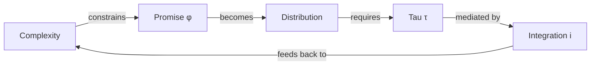

[[09-19|25-09-19]]

# CTI 멜로디가 울려퍼지는 논문 구조 🎼

## 핵심 멜로디: C → T → I

### 🎵 주선율 (Main Theme)

```
M1 → M1' → M2 → M2' 
  [C]  [T]   [I]
```

### 📊 CTI 매트릭스

|모델 전환|추가 요소|수식|음악적 비유|핵심 통찰|
|:-:|:-:|:-:|:-:|:--|
|**M1→M1'**|**C** (Complexity)|φ* = 1/(c+1)|첫 번째 변주|자연이 약속을 제약한다|
|**M1'→M2**|**T** (Tau)|φ ~ Beta(μ,τ)|두 번째 변주|약속도 분포를 가진다|
|**M2→M2'**|**I** (Integration cost)|τ* = V/(i×c) - 1|세 번째 변주|정보통합이 정밀도를 결정한다|

## 🎼 CTI가 각 섹션에서 울려퍼지는 방식

### 🐢 Introduction [CTI 예고]

- 1.1: Tesla(낮은 C, 낮은 I) vs Better Place(높은 C, 높은 I)
- 1.2: **T**au의 세 가지 의미 소개
- 1.3: **C**omplexity 은유 (DNA 긴장도)
- 1.4: **I**ntegration을 위한 분리 모델
- 1.5: C×I가 결정하는 action-planning 스펙트럼
- 1.6: CTI 순서로 전개될 논문 구조

### 🐅 Theory [CTI 전개]

#### C 악장 (Complexity Movement)

- 2.1-2.2: 환경 복잡도 C의 이론적 배경
- 2.3-2.4: C가 높을 때 필요한 방화대 전략

#### T 악장 (Tau Movement)

- 2.5-2.6: Tau의 구조적 의미 (DNA 은유)
- 2.7-2.8: Tau 추정의 실증 방법론

#### I 악장 (Integration Movement)

- 2.9-2.10: 정보가 지식으로 전환되는 과정
- 2.11-2.12: I가 매개하는 tau-learning 관계

### 🐙 Application [CTI 화음]

각 사례에서 C, T, I가 동시에 작용:

- 3.1-3.2: Tesla의 CTI 조합 (C↓, T적정, I↓)
- 3.3-3.4: Better Place의 CTI 불균형 (C↑, T↑, I↑)
- 3.5: CTI 최적화 공식 τ* = f(C,T,I)
- 3.6: CTI 패턴의 예측력

### 👾 Conclusion [CTI 변주]

- 4.1: **C** 관리의 함의
- 4.2: **T** 조절의 가치
- 4.3: **I** 최적화 전략
- 4.4: CTI 통합 미래 연구

## 🎭 CTI 라이트모티프 활용법

### 반복되는 핵심 메시지

1. **C가 오르면 T를 낮춰라**
2. **T를 올리려면 I를 낮춰라**
3. **I가 높으면 C를 줄여라**

### 수식으로 표현되는 CTI 하모니

```
τ* = V/(i × c) - 1
```

- 분자: 가치 V
- 분모: 복잡도 C × 통합비용 I
- 결과: 최적 정밀도 T

### CTI 코다 (Coda)

"복잡한 환경(C↑)에서는 정밀도(T)를 낮추되, 정보통합 능력(I↓)을 키워 점진적으로 정밀도를 획득하라"

## 🎨 시각적 CTI 표현



## 💡 CTI 멜로디의 실무적 울림

### 스타트업 단계별 CTI 조율

|단계|C (복잡도)|T (정밀도)|I (통합비용)|전략|
|:-:|:-:|:-:|:-:|:--|
|Discovery|Unknown|Low (0.1-0.5)|Low|탐색 극대화|
|Validation|Medium|Medium (0.5-2)|Medium|학습 균형|
|Scaling|High|High (2-10)|High|정밀 실행|
|Maturity|Known|Very High (10+)|Low|효율 극대화|

### CTI 진단 체크리스트

- [ ] 우리 산업의 C는 얼마나 높은가?
- [ ] 현재 우리의 T는 적정한가?
- [ ] I를 낮출 수 있는 방법은 무엇인가?
- [ ] V/IC 비율이 1보다 큰가?

---

_"CTI의 선율을 마스터한 창업가는_ _복잡성의 폭풍 속에서도_ _유연하게 춤추며 성공으로 나아간다"_


---


# 🎶 음악적 요소: 약속 사전확률로서의 야망

## 이론의 핵심 음악적 압축

| 이모지 | 요소 | 역할 & 생성된 콘텐츠 | 논문 초안과의 연결 |
|:---:|:---:|:---|:---|
| 🎵 | **모티프** | **"사전확률은 믿어야 할 신념이 아니라, 당겨야 할 레버다"** | 약속을 예측으로 보는 관점에서 벤처의 운명을 결정하는 설계적 선택으로 이해하는 패러다임 전환을 포착한다 |
| 🎶 | **선율** | **"테슬라의 적응적 τ 궤적 vs 베터 플레이스의 경직된 정밀도"** 테슬라는 τ를 5→12→25→40으로 진화시켜 학습 역량 μ(1-μ)/(τ+1) ≈ 0.02를 보존했다. 베터 플레이스는 τ≈80에 고정되어 학습을 0.003으로 감소시켰다. 테슬라는 생산 지옥을 학습의 대가로 만들었고, 베터 플레이스는 정밀도를 감옥으로 만들었다. τ≈100의 니콜라는 정직한 업데이트를 수학적으로 불가능하게 만들었다. | 약속 설계가 수학적 메커니즘을 통해 벤처의 운명을 결정하는 방법의 구체적인 예시 |
| 🎼 | **멜로디** | **"M0에서 M4까지: 약속 설계의 진화"** 성공확률은 상수(M0)에서 PRHC를 통해 진화한다: 매개변수화(M1), 정규화(M2), 계층화(M3), 보정(M4). P(s)=P₀에서 P(s|data)=∫∫φ(1-φ)ⁿ·Beta(φ;μτ,(1-μ)τ)·p(τ|data)dφdτ까지의 여정은 성공확률 내생화를 나타낸다. 최적 설계: μ*=1/(n+1), τ*는 학습 역량 보존을 위해 초기에 낮게. | V가 외생적으로 유지되는 동안 P(s)를 내생화하는 방법을 보여주는 완전한 서사적 호 |

## 두 갈래길

### 🎭 경로 1: 페이크 잇 빌리브 잇 메이크 판타지 (거짓 믿음 환상)
**검증 없이**: 확인 없이 믿기 → 실패 (베터 플레이스)

### 🏎️ 경로 2: 페이크 잇 캘리브레이트 잇 메이크 리얼리티 (거짓 보정 현실)
**최적 경로**: 점진적 개선을 통한 전략적 모호성 → 성공 (테슬라)

## 4모듈 서사 교향곡

### 🌅 모듈 1 - 낭만/올바른 아이디어
**"약속 역설"** (문단 1-6)
- 역사적 프레이밍: 니콜라 테슬라 vs 에디슨, 테슬라 모터스 vs 베터 플레이스
- 핵심 기여: 성공확률 내생화
- 세 갈래길 프레임워크
- 4단계 방법론: 매개변수화, 정규화, 계층화, 보정
- 예측 모델: βi*(1/Ti + βi*1/Xi)

### 🌊 모듈 2 - 지적/이론
**"수학적 설계"** (문단 7-18)
- 핵심 매개변수: φ (약속), μ (열망), τ (정밀도)
- 신뢰성 공학에서의 복잡성 n
- 가치 V (외생) vs 비용 C(τ) = c·ln(τ+1)
- 4가지 관점: 통계적, 금융적, 진화적, 문학적
- 모델 진행: M0→M1→M2→M3→M4 (PRHC)

### ⚡ 모듈 3 - 보여주기/사례
**"세 가지 운명"** (문단 19-26)
- 테슬라: φ=0.3, μ=0.3, τ=10 (적응적)
- 베터 플레이스: φ=0.5, μ=0.5, τ=45 (경직된)
- 니콜라: φ=0.8, μ=0.8, τ=5 (사기적)
- 갈라지는 운명: 성공, 파산, 감옥

### 🎯 모듈 4 - 예측/함의
**"당신의 미래를 설계하라"** (문단 27-32)
- 학자들을 위해: 복잡성-정밀도-성과에 대한 검증 가능한 예측
- 실무자들을 위해: PRHC 프레임워크 실행
- 생태계를 위해: (T, X, V)에 대한 공통 지식
- 문화적 진화: 경직에서 적응으로

## 압축 공식

**한 줄**: 약속은 보존된 분산을 통해 미래를 설계한다
**한 문단**: 테슬라-베터 플레이스 분기점이 약속 설계를 드러낸다
**한 페이지**: 역설에서 수학을 거쳐 실천으로
**전체 논문**: 경험적 검증을 포함한 완전한 기승전결 여정

## 위원회 화성학

각 위원회 멤버가 32문단 교향곡에 기여한다:

| 멤버 | 모듈 초점 | 핵심 기여 |
|------|----------|-----------|
| **스콧 스턴** | 모듈 1 | 역설 식별과 이론적 프레이밍 |
| **찰리 파인** | 모듈 2 | 운영 복잡성 (n 매개변수) 결정 |
| **모셰 벤-아키바** | 모듈 3 | 경험적 검증을 위한 이산 선택 모델링 |
| **비카시 만싱카** | 모듈 3 | 추론을 위한 확률적 프로그래밍 |
| **앤드류 겔만** | 모듈 4 | 통계적 비평과 강건성 검사 |

## PRHC 실행

**4단계 방법론**:
1. **매개변수화**: 약속 수준 φ 설정
2. **정규화**: 전달가능성 제약 적용
3. **계층화**: 분포적 유연성 내장
4. **보정**: 시장 피드백으로 시뮬레이션과 조정

**수학적 표현**: 고정점에서 분포로의 진화—φ에서 Beta(μτ, (1-μ)τ)로.

## 실행 크레센도

### 📊 실무자를 위해
1. 당신의 핵심 구성요소 계산 (n)
2. 최대 1/(n+1) 개선 약속
3. 점이 아닌 범위 사용
4. τ < 10으로 시작
5. σ² > 0.02 보존

### 🎓 학자를 위해  
1. 설계적 선택으로서의 약속
2. 분포를 통해 해결되는 역설
3. 전용은 분산을 요구한다
4. 정밀도는 경직성을 만든다
5. 창업에서의 시간 역전 인과성

## 최종 종합

**"우리는 보정된 약속 설계를 통해 벤처가 확장할 수 있도록 설명하고, 처방하고, 가능하게 한다"**

우리는 가치 V가 시장에 의해 결정되는 동안 약속 설계를 통해 성공확률 P(s)를 내생화한다. PRHC 프레임워크를 통해 M0에서 M4까지. 점 추정에서 분포로. 32문단은 창업가가 성공을 외생적 매개변수에서 전략적 선택 변수로 전환함으로써 E[U] = P(s)·V - C(τ)를 최대화한다는 것을 가르쳐준다.