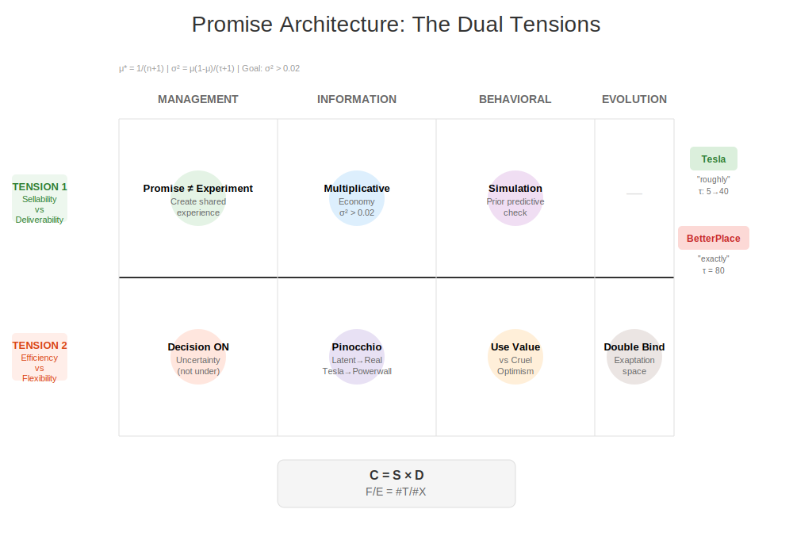

# 승수전문: 약속 구조의 이중 긴장과 시간 역학

## 그림 1: 점 약속 vs 분포적 약속의 시간 전개


### 핵심 통찰: 시간에 따른 약속 구조의 진화

이 다이어그램은 **점 약속(Point Mass Promise)**과 **분포적 약속(Distributional Promise)**이 시간 축(t → t+1 → t+2)을 따라 어떻게 다르게 전개되는지 보여줍니다.

#### 왼쪽: 점 약속의 함정
- **t 시점 (시뮬레이션)**: φ = 고정된 값으로 약속 생성
- **t+1 시점 (보정)**: 관찰된 S, D에도 불구하고 τ가 너무 높아 μ 업데이트 제한
- **t+2 시점 (실현)**: 피벗 불가능, 경직된 실행

**수학적 함정**: τ=100일 때, 10번의 실패(β=10)도 μ를 0.9에서 0.891로만 이동
→ **학습 함정**: |Δμ| < ε/(τ+1) ≈ 0

#### 오른쪽: 분포적 약속의 적응
- **t 시점**: φ ~ Beta(μτ, (1-μ)τ)로 분포적 약속
- **t+1 시점**: μ와 τ 모두 업데이트 가능, 유연한 보정
- **t+2 시점**: 피벗 가능, 적응적 실현

**전용 공간 보존**: σ² = μ(1-μ)/(τ+1) > 0.02 유지
→ 예기치 못한 가치 창출 가능 (Tesla 배터리 → 파워월)

---

## 그림 2: MIBE 프레임워크의 이중 긴장 매트릭스



### 핵심 구조: 두 긴장관계의 교차점

이 매트릭스는 창업가적 약속이 직면하는 **두 가지 근본적 긴장**을 2×2 공간에 매핑합니다:

#### 긴장 1 (녹색 - 수평축): 판매가능성 vs 전달가능성
- **왼쪽 (Sellable)**: 시장이 원하는 것 - 혁명적 비전
- **오른쪽 (Deliverable)**: 운영이 가능한 것 - 점진적 실행
- **해결 공식**: C = S × D (보정된 성공)

#### 긴장 2 (빨간색 - 수직축): 검증가능성 vs 유연성  
- **위쪽 (Verifiable)**: 이해관계자가 요구하는 정밀도
- **아래쪽 (Flexible)**: 피벗을 위한 모호함
- **해결 공식**: F/E = #T/#X (평가지표/자원형태 비율)

### 사분면별 이론적 기여

#### Q1 (좌상): 판매가능 + 검증가능
- **M1 (경제/경영)**: 실험이 아닌 약속 - "공유된 경험의 약속"
- **함정 사례**: BetterPlace의 "정확히 3분" (τ=80) → 정밀도 감옥

#### Q2 (우상): 전달가능 + 검증가능
- **I1 (정보이론)**: 음의 엔트로피 소비, 시간 역전
- **I2 (피노키오 원리)**: 계산 편의가 현실로 실체화

#### Q3 (좌하): 판매가능 + 유연한
- **B1 (행동/인지)**: 시뮬레이션 기반 거부, prior predictive check
- **B2 (그룹 사전분포)**: 욕망과 믿음, negative capability

#### Q4 (우하): 전달가능 + 유연한
- **E2 (진화론)**: 이중 구속, 효율성 vs 유연성의 역설
- **성공 사례**: Tesla의 "대략 200마일" (초기 τ=5) → 배터리 기술 옵션

### 통합적 시사점

1. **최적 위치**: 중앙에서 약간 우하단
   - 충분한 판매가능성 + 실제 전달가능성
   - 초기 유연성 + 점진적 검증가능성 증가

2. **동적 경로**: 
   - 시작: 좌하 (판매가능 + 유연)
   - 중간: 중앙 (균형)
   - 성숙: 우상 (전달가능 + 검증가능)

3. **핵심 공식 통합**:
   ```
   성공 = (S × D) × (F/E > 임계값)
   where:
   - S = 판매가능성 = f(μ)
   - D = 전달가능성 = (1-μ)^n
   - F/E = 유연성 비율
   - μ* = 1/(n+1)
   - σ² > 0.02 (전용 공간)
   ```

### 실무적 함의

**초기 단계 (Nail)**: 
- Q3에서 시작 (판매가능 + 유연)
- τ < 10 유지, μ는 시장 반응에 따라 조정

**성장 단계 (Scale)**:
- 중앙으로 이동
- τ를 점진적으로 증가 (매 검증마다 +5)

**성숙 단계 (Sail)**:
- Q2 방향으로 이동 가능
- 단, σ² > 0.02 항상 유지

이 두 그림은 창업가적 약속 설계의 **시간적 차원**과 **구조적 차원**을 통합적으로 보여주며, 점 약속의 함정을 피하고 분포적 약속의 적응력을 활용하는 방법을 시각화합니다.