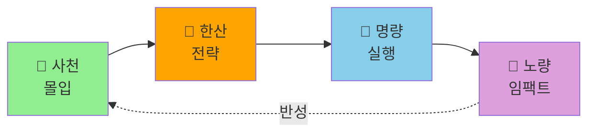

---
up:
  - - Home
출생: 2025-10-09
type: map
---

# 🗺️ 사대전장 연결지도

> **"지피지기면 백전불태 (知彼知己 百戰不殆)"**  
> 적을 알고 나를 알면 백번 싸워도 위태롭지 않다.

---

## 🌊 전장의 흐름



---

## 🎯 각 전장의 본질

### 🐢 제1전장: 사천 (What)
**본질**: 문제 탐색과 이론 구축  
**질문**: "이 문제는 무엇인가?"  
**산출물**: 문제 정의, 이론적 프레임워크  
**다음**: 문제가 명확해지면 → 한산으로

**대표 노트**:

```dataview
LIST
FROM "Atlas/1-사천-몰입"
WHERE contains(file.name, "🐢")
LIMIT 5
```

---

### 🐅 제2전장: 한산 (Why)  
**본질**: 전략과 모델 설계  
**질문**: "왜 이렇게 작동하는가?"  
**산출물**: 베이지안 모델, 프레임워크, 전략  
**다음**: 모델이 완성되면 → 명량으로

**대표 노트**:
```dataview
LIST
FROM "Atlas/2-한산-전략"
WHERE contains(file.name, "🐅")
LIMIT 5
```

---

### 🐙 제3전장: 명량 (How)
**본질**: 실행과 협업  
**질문**: "어떻게 작동하는가?"  
**산출물**: 케이스 스터디, 실증 테스트, 협업 결과  
**다음**: 검증이 완료되면 → 노량으로

**대표 노트**:
```dataview
LIST  
FROM "Atlas/3-명량-협업"
WHERE contains(file.name, "🐙")
LIMIT 5
```

---

### 👾 제4전장: 노량 (So What)
**본질**: 의미 부여와 레거시  
**질문**: "그래서 무엇이 중요한가?"  
**산출물**: 논문 완성, 임팩트 정리, 교육 자료  
**다음**: 성찰 후 → 다시 사천으로 (새로운 문제)

**대표 노트**:
```dataview
LIST
FROM "Atlas/4-노량-임팩트"  
WHERE contains(file.name, "👾")
LIMIT 5
```

---

## 🔄 전장 간 이동 신호

### 사천 → 한산
**이동 시점**: 
- 문제가 충분히 이해되었을 때
- "왜?"라는 질문이 생길 때
- 이론적 토대가 필요할 때

### 한산 → 명량  
**이동 시점**:
- 모델이 완성되었을 때
- 실제 테스트가 필요할 때
- 협업자가 필요할 때

### 명량 → 노량
**이동 시점**:
- 실증이 완료되었을 때
- 결과를 정리할 때
- 의미를 새길 때

### 노량 → 사천
**이동 시점**:
- 논문이 완성되었을 때
- 새로운 문제가 보일 때
- 다음 싸움을 준비할 때

---

## 📊 전장별 현재 상태

```dataview
TABLE 
  length(file.outlinks) as "연결수",
  length(file.inlinks) as "참조됨",
  file.mtime as "최근수정"
FROM "Atlas"
WHERE file.name != "Maps"
SORT file.mtime desc
```

---

## 🎯 주요 프로젝트의 전장 여정

### Oil Framework 논문
1. 🐢 **사천**: 문제 정의 (정밀도-약속 역설)
2. 🐅 **한산**: Oil Framework 모델 구축
3. 🐙 **명량**: Tesla/Better Place 케이스 분석  
4. 👾 **노량**: 논문 완성 및 임팩트 (← 현재)

### 베이지안 창업 연구
1. 🐢 **사천**: 창업가 의사결정 문제 탐색 (← 현재)
2. 🐅 **한산**: 베이지안 모델 설계 (진행중)
3. 🐙 **명량**: 실증 데이터 수집 (준비)
4. 👾 **노량**: Second paper

---

## 💡 전장 활용 팁

**병행 전략**
- 여러 프로젝트가 각기 다른 전장에 있을 수 있음
- Oil Framework는 노량, 새 연구는 사천

**집중 전략**  
- 한 번에 한 전장에만 집중
- Efforts/On에 하나만 두기

**순환 전략**
- 매일 다른 전장 방문
- 오전: 한산(모델링), 오후: 명량(실행)

---

## 🔗 관련 지도

- [[venture world]] - 불확실성 속의 항해
- [[dew]] - 교육을 통한 레거시
- [[Home]] - 전장 사령부로 복귀

---

*"싸움은 계속된다. 전장을 알고, 때를 알고, 나를 알라."*
