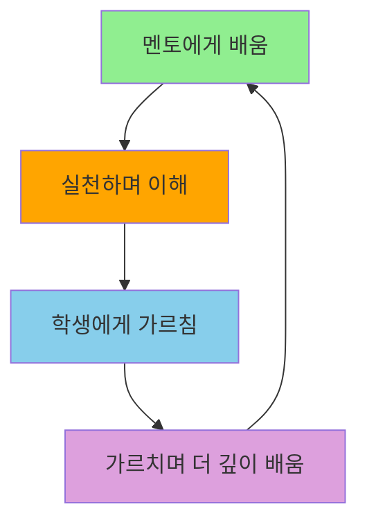

---
up:
  - - Home
출생: 2025-10-09
type: map
---
[[10 참나라니 참나]], [[이연]]'s 악귀퇴마사

# 🎓 교수-학생 연결지도

> **"가르침은 배움의 완성이요, 배움은 가르침의 시작이다"**

---

## 🌊 노량의 정신

노량해전은 이순신의 마지막 전투이자, 그의 legacy가 완성된 순간입니다.  
교육도 마찬가지로, 우리의 지식이 다음 세대로 전달되며 불멸이 됩니다.

**"내 죽음을 알리지 말라" → "내 가르침은 계속된다"**

---

## 👨‍🏫 나의 멘토들 (배움)

### Charlie Fine
**분야**: Strategic Management, Operations  
**배운 것**: 
- Clockspeed theory
- System dynamics
- 산업 분석

**주요 교류**:
```dataview
LIST
FROM "Calendar/Daily"
WHERE contains(file.content, "Charlie")
SORT file.mtime desc
LIMIT 10
```

---

### Scott Stern  
**분야**: Entrepreneurial Strategy
**배운 것**:
- Strategic entrepreneurship
- Innovation ecosystems
- Choice-based frameworks

---

### Vikash Mansinghka
**분야**: Probabilistic Programming  
**배운 것**:
- Bayesian inference
- Gen.jl, Probabilistic programming
- Computational cognitive science

---

### Tom Rosenfield
**분야**: Operations, Supply Chain
**배운 것**:
- Inventory management
- Dynamic optimization
- Practical operations

---

## 👨‍🎓 나의 학생들 (가르침)

### Operations for Entrepreneurship TA
**역할**: Teaching Assistant  
**가르치는 것**:
- Supply chain basics
- Inventory management
- Decision-making under uncertainty

**학생 노트**:
```dataview
LIST
FROM "Atlas/4-노량-임팩트/student"
SORT file.mtime desc
```

---

### 1:1 멘토링
**활동**:
- Office hours
- 논문 지도
- 커리어 조언

---

## 🔄 가르침-배움의 순환



---

## 📚 교육 자료 개발

### 강의 노트
- [[Atlas/4-노량-임팩트/teaching/Operations-Lecture-Notes]]
- [[Atlas/4-노량-임팩트/teaching/Bayesian-Tutorial]]
- [[Atlas/4-노량-임팩트/teaching/Stan-Workshop]]

### 실습 자료
- [[Atlas/4-노량-임팩트/teaching/Inventory-Exercise]]
- [[Atlas/4-노량-임팩트/teaching/Bayesian-Case-Study]]

---

## 💡 가르치며 배운 것

### 단순화의 힘
**깨달음**: 복잡한 개념을 단순하게 설명하려 노력하면서,  
나 자신도 더 깊이 이해하게 됨

**예시**:
- 베이지안을 가르치며 → Prior의 본질 재발견
- 재고 관리를 가르치며 → Newsvendor의 철학 이해

### 질문의 가치  
**깨달음**: 학생의 질문이 때로는 가장 깊은 통찰을 줌

**기억에 남는 질문들**:
- "Prior를 어떻게 정하나요?" → Oil Framework의 precision 개념으로 연결
- "언제 피봇해야 하나요?" → Bayesian updating으로 설명 가능

---

## 🎯 교육 철학

### 1. 이순신의 교육법
**원칙**: 몸소 보이다 (以身作則)
- 이론만이 아닌 실천
- 말보다 행동으로
- 함께 전장에서

### 2. 베이지안 교육  
**원칙**: 믿음을 업데이트하라
- 학생의 prior를 존중
- Evidence를 함께 탐색
- Posterior를 함께 구축

### 3. 협력적 배움
**원칙**: 명량의 정신 - 12척으로 330척을
- 소수라도 협력하면 가능
- 각자의 강점 활용
- 서로 배우고 가르치며

---

## 📊 멘토십 현황

### 정기 미팅
```dataview
TABLE
  mentor as "멘토",
  frequency as "빈도",
  last_meeting as "최근"
FROM "Calendar/Daily"  
WHERE contains(file.content, "meeting") OR contains(file.content, "office hour")
GROUP BY mentor
```

### 가르치는 수업
```dataview
LIST
FROM "Atlas/4-노량-임팩트/teaching"
WHERE file.name != "README"
```

---

## 🌱 미래의 가르침

### 계획 중인 활동
- [ ] 베이지안 창업 워크샵 개발
- [ ] Oil Framework 튜토리얼 제작
- [ ] Stan for Entrepreneurs 시리즈

### 꿈꾸는 Legacy
- 창업가들이 사용하는 의사결정 도구
- 베이지안 사고를 널리 전파
- 다음 세대 연구자 양성

---

## 💭 성찰

### 스승의 의미
*"스승은 물을 주는 사람이 아니라,  
씨앗이 스스로 자랄 토양을 만드는 사람이다"*

### 학생의 의미  
*"학생은 빈 그릇이 아니라,  
이미 씨앗을 품고 있는 땅이다"*

---

## 🔗 연결

**상위**:
- [[Home|전장 사령부]]
- [[현지 멜로디|노량 전장]]

**관련**:
- [[Atlas/4-노량-임팩트/student|학생 폴더]]
- [[Atlas/4-노량-임팩트/teaching|교육 자료]]
- [[Atlas/4-노량-임팩트/university|대학 관련]]

---

*"가르침으로 배우고, 배움으로 가르치라"*

**이것이 노량의 정신, 이것이 legacy다.**
