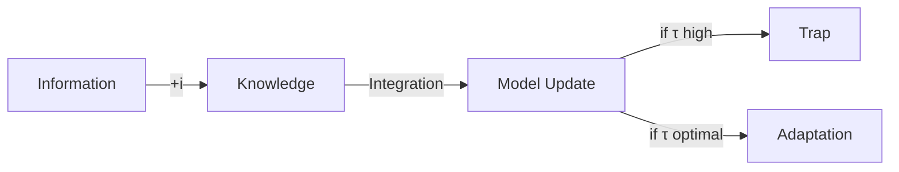

- optimal ignorance: [[tom_griffith]] rational을 안 쓰고 optimal을 쓴 이유설명
- 
- 

---

*"The art of being wise is the art of knowing what to overlook." - William James* *우리는 이를 수학으로 증명했다: τ* = 0 when V/ic < 1*

---

information integration cost 🧬i ($/bit) and rational Ignorance 
larger tau = potential for contraction (consistent with [[📜🐢Brinkerink25_neg_cap_ent_act]])
how relevant with dna straand꼬임정도? low 꼬임 (tau) permeable to nature; intelligently adjusting this permeability = rational ignorance

정보 → 지식 전환 메커니즘

**i = Information Integration Cost**
- 새 정보 이해 비용
- 기존 모델과의 일관성 회복
- 조직 문화 업데이트 (채용 비유) from [[The_Founder_s_Dilemma.mp4]] and its transcript  [[🏇founder rational ignorance_otter_ai.txt]] 

## 서론: 무지의 재발견

"Knowledge is power"라는 Francis Bacon의 격언은 4세기 동안 진리로 받아들여졌다. 정보화 시대는 이를 극단으로 밀어붙였다. 빅데이터, AI, 실시간 분석—모든 것이 더 많은 정보를 향한 질주다. 그러나 우리는 역설적 진실을 발견했다: 때로는 모르는 것이 더 강력하다. 이것은 단순한 무지가 아니라 전략적으로 설계된 무지, 우리가 "Strategic Ignorance"라 부르는 현상이다.

## 수학적 기초: τ* = max(0, V/ic - 1)

### 공식의 해부

우리의 핵심 공식은 단순해 보이지만 혁명적이다:

**τ* = max(0, V/ic - 1)**

여기서:
- V: 벤처의 잠재 가치
- i: 정보 통합 비용 (information integration cost)
- c: 시스템 복잡도 (complexity)
- τ: 집중도 (concentration)

이 공식이 말하는 것은 명확하다. V/ic < 1일 때, 즉 가치가 정보 처리 비용보다 작을 때, τ* = 0이다. 완전한 무지, 최대한의 모호함이 최적이 된다.

### 경제학적 직관

전통 경제학은 정보를 무료 재화로 가정한다. 현실에서 정보는 세 가지 비용을 수반한다:

1. **획득 비용**: 데이터 수집과 처리
2. **통합 비용**: 기존 지식과의 일관성 확보
3. **기회 비용**: 다른 정보를 포기하는 대가

우리 모델은 통합 비용 i에 주목한다. 이는 단순한 계산 비용이 아니다. 조직이 새로운 정보를 소화하는 과정—Andrew Gelman이 "rational meaning construction"이라 부른—의 총체적 비용이다.

## Cruel Optimism의 수학: 최대가 아닌 최적

### Lauren Berlant의 통찰을 수식으로

문화이론가 Lauren Berlant의 "cruel optimism"은 우리가 원하는 것이 오히려 우리를 파괴하는 역설을 포착한다. 우리는 이를 수학적으로 표현한다:

**Model M2 (Deterministic):**
P = φ(1-φ)^n
최적점: φ* = 1/(n+1)에서 최대값

**Model M3 (Stochastic):**
P = ∫ φ(1-φ)^n Beta(φ|μτ, (1-μ)τ) dφ
결과: E[P] < P_max

놀랍게도 평균 성공률은 최대값보다 작다. 그러나 이것이 실패를 의미하지 않는다. 분산 Var[P]가 생존을 가능케 한다. 너무 확실한 약속(Var→0)은 실패 시 완전 붕괴를 의미한다. 적절한 불확실성(Var>0)은 재해석과 피벗의 공간을 보존한다.

### Negative Capability의 계량화

시인 John Keats가 말한 "negative capability"—불확실성과 의심 속에서도 편안함을 유지하는 능력—을 우리는 계량화한다:

**NC = 1/(τ+1)**

τ가 낮을수록 negative capability가 높다. Tesla의 초기 τ ≈ 2-3은 높은 NC를 유지했고, 이것이 적응과 진화를 가능케 했다. Better Place의 τ → ∞는 NC → 0을 의미했고, 경직된 구조는 붕괴했다.

## 세 가지 무지의 유형학

### Type 1: Destructive Ignorance (파괴적 무지)

모르는 것을 모르는 상태다. Blockbuster는 Netflix의 위협을 인지하지 못했다. Kodak은 디지털 사진의 파급력을 과소평가했다. 이들의 무지는 의도적이지 않았고, 따라서 파괴적이었다.

특징:
- 환경 스캔 실패
- 약한 신호 무시
- 변화 거부

### Type 2: Passive Ignorance (수동적 무지)

모르는 것을 알지만 방치하는 상태다. 많은 전통 기업이 여기 속한다. 디지털 전환의 필요성은 알지만 행동하지 않는다. 정보는 있지만 통합하지 않는다.

특징:
- 정보 과부하
- 분석 마비
- 의사결정 지연

### Type 3: Strategic Ignorance (전략적 무지)

모르기로 선택하는 상태다. 이것이 우리의 기여다. Amazon의 Jeff Bezos가 말한 "Day 1" 철학—영원한 초심 유지—이 대표적이다. 의도적으로 일부 정보를 차단하여 창의성과 유연성을 보존한다.

특징:
- τ = 0 선택
- 적응 공간 확보
- 학습 능력 유지

## 정보 통합의 숨겨진 비용

### The Digestion Cost

정보를 지식으로 전환하는 과정을 우리는 "digestion"이라 부른다. 음식이 영양분이 되듯, 정보는 소화되어야 지식이 된다. 이 과정의 비용 구조:

**C(digestion) = i × [ln(τ+1) + consistency_cost + coordination_cost]**

여기서:
- ln(τ+1): 정보량에 따른 로그 증가
- consistency_cost: 기존 모델과의 일관성 회복
- coordination_cost: 조직 전체의 동기화

### 실증 사례: AI 시대의 역설

AI 시대, 정보 획득 비용은 0에 수렴한다. 그러나 통합 비용은 오히려 증가한다. ChatGPT는 무한한 답을 제공하지만, 어떤 답을 믿고 행동할지 결정하는 비용은 폭발적으로 증가했다.

이것이 우리 시대의 역설이다:
- 정보 풍요, 의미 빈곤
- 데이터 과잉, 지혜 부족
- 연결 과다, 이해 결핍

## Bounded Rationality와의 연결

### Herbert Simon의 유산

Herbert Simon의 bounded rationality는 인간의 인지적 한계를 인정했다. 우리는 한 걸음 더 나간다. 한계는 제약(bug)이 아니라 특징(feature)이다.

Tom Griffiths와 동료들의 연구는 이를 뒷받침한다. "Bounded Optimality"—제약 하에서의 최적성—는 완벽한 합리성보다 우월할 수 있다. Quick and dirty heuristics가 slow and accurate algorithms를 이기는 이유다.

우리 모델에서:
- High τ = Unbounded rationality 추구 = Learning trap
- Low τ = Bounded optimality 수용 = Adaptive capacity

### Vul et al.(2014)의 놀라운 발견

인지과학자 Edward Vul과 동료들은 충격적 발견을 했다. 인간은 단 1-3개의 샘플만으로도 거의 최적의 의사결정을 한다. 국지최적화를 피하는게 전역최적화가 된다는 이 논리는 전략적인 무지를 택하는 우리 모델과 유사하다

**Sparse Sampling with Low τ:**
- τ = 2-3: 소수 샘플, 빠른 결정
- 베이지안 최적과 유사한 성과
- Tesla의 초기 전략과 일치

이것이 "productive ambiguity"가 작동하는 이유다. 완벽한 정보는 불필요할 뿐 아니라 해롭다.

## 전략적 함의: The New Skill

### 21세기의 핵심 역량

> "In a world drowning in information, the most important strategic skill is knowing what to ignore."

이것은 단순한 격언이 아니라 생존 전략이다. 성공한 창업가들의 공통점:

1. **Selective Attention**: 핵심 신호만 포착
2. **Strategic Forgetting**: 의도적 망각
3. **Productive Ambiguity**: 생산적 모호함 유지

### 실천 가이드라인

**When τ = 0 is Optimal:**

1. 초기 단계 (V가 불확실)
2. 격변기 (c가 높음)
3. 자원 제약 (i가 높음)

**구체적 행동:**
- "We're exploring..." (not "We will...")
- 옵션 유지, 약속 보류
- 빠른 실험, 느린 확정

## 결론: 무지의 지혜

우리는 무지를 재정의했다. 파괴적 무지와 수동적 무지를 넘어, 전략적 무지의 가능성을 열었다. τ* = max(0, V/ic - 1)은 단순한 공식이 아니라, 정보 시대의 생존 전략이다.

Socrates는 "나는 내가 모른다는 것을 안다"고 했다. 우리는 한 걸음 더 나간다: "나는 무엇을 모를지 선택한다." 이것이 strategic ignorance의 본질이다.

창업가는 이제 정보의 노예가 아니라 주인이다. 무엇을 알고 무엇을 모를지 전략적으로 선택할 수 있다. 이것이 불확실성의 바다에서 항해하는 새로운 나침반이다.
