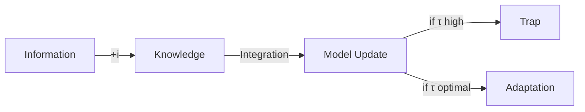

# 🎹 약속설계의 음계: Entrepreneurial Promise as Bayesian Adaptation

[[0(약속설계)]]
Bayesian and Evolutionary entrepreneurship with double binding promise
## 논문의 3대 기여 아키텍처

### 🌲 Contribution 1: SEPARATION (분리)
**Founder ≠ Venture**: 창업가와 벤처를 분리하여 지식과 의도가 비즈니스 모델링에 미치는 영향 서술

### 🌀 Contribution 2: ENDOGENIZATION through Two Reparameterizations (두 번의 재매개변수화를 통한 내생화)
**Cascading Transformation**: 
- **First**: Success probability → Promise level (φ) + Nature's complexity (c)
- **Second**: Promise level → Aspiration level (μ) + Concentration level (τ)

### 🌉 Contribution 3: BRIDGING (가교)
**Action ↔ Planning**: 무지의 합리화를 통한 행동학파와 계획학파 연결

---

## 모델 진화: Base + Uncertainty Extension 패턴

### 📊 모델 구조 매트릭스

| 모델 | 유형 | 재매개변수화 | 불확실성 추가 | 핵심 통찰 |
|:---:|:---:|:---|:---|:---|
| **M1** | Base | Success → Promise (φ) | - | 약속이 성공확률을 매개 |
| **M1'** | +Nature | Success → Promise (φ) | c (complexity) | φ* = 1/(c+1) |
| **M2** | Base | Promise → Aspiration (μ) | - | 약속도 분포를 가짐 |
| **M2'** | +Founder | Promise → Aspiration (μ) | τ (concentration) | Learning trap vs Rational ignorance |

---

## 4모듈 × 4감각 구조화 (M1, M1', M2, M2' 반영)

| 모듈 | 🐢낭만거북의 **철학적 탐구** | 🐅세련호랑지의 **수학적 정교화** | 🐙절절문어용의 **실증적 포착** | 👾똘똘외계현의 **통합적 지혜** |
|:---:|:---|:---|:---|:---|
| **M1** 📐Base Model 1 *Reparameterize I* | **성공의 재정의** • P(success) → P(promise) • 약속이 곧 성공의 언어 • "말이 씨가 된다" | **첫 번째 재매개변수화** • s,d ~ Bernoulli(φ) • φ ∈ [0,1]: 약속수준 • 단순 변환 모델 | **초기 스타트업의 선언** • "We will revolutionize..." • 구체성 없는 비전 • 순수한 의지의 표현 | **분리의 시작** • 창업가의 말 ≠ 벤처의 현실 • 약속이라는 인터페이스 발견 • 측정 가능한 구조 창출 |
| **M1'** 🌿Extended 1 *+Nature's Uncertainty* | **자연의 개입** • 복잡성이 약속을 제약 • "Man proposes, God disposes" • 겸손의 필요성 | **자연 불확실성 추가** • φ* = 1/(c+1) • c: 운영 복잡도 • **Proposition 1** 도출 | **Better Place의 교훈** • c=∞에서 φ=1 선택 • "정확히 5분" → $850M 손실 • 자연을 무시한 대가 | **첫 번째 지혜** • 복잡할수록 보수적으로 • 자연은 통제 불가능 • Reliability engineering 원리 |
| **M2** 📈Base Model 2 *Reparameterize II* | **약속의 약속** • 메타 레벨 상승 • "나는 얼마나 약속할 것인가" • 열망의 도입 | **두 번째 재매개변수화** • φ ~ Beta(μ,τ) • μ: 열망수준 • 분포적 사고 시작 | **산업별 패턴 관찰** • Biotech: 높은 열망 • Software: 적응적 열망 • 생태계의 영향 | **계층적 사고** • Promise about promise • 불확실성의 불확실성 • Hierarchical Bayes 구조 |
| **M2'** 🎯Extended 2 *+Founder's Uncertainty* | **의도적 무지** • Rational ignorance • "모르는 것이 힘" • 정보 vs 지식 구별 | **창업가 불확실성 추가** • τ: 집중도 • i: 정보통합비용 • **Proposition 2a,b** 도출 | **Tesla vs Nikola** • Tesla: 적응적 τ • Nikola: τ→∞ (함정) • Slack: 15번 피봇 (τ 조절) | **최종 통합** • τ→∞: Learning trap • τ→0 조건: V↑∨i↓∨c↓ • Designed uncertainty의 가치 |

---

## 핵심 구별: 이중 불확실성 구조

### 🌍 자연의 불확실성 (M1') vs 🧠 창업가의 불확실성 (M2')

| 구분 | 자연 (M1') | 창업가 (M2') |
|:---:|:---|:---|
| **매개변수** | c (complexity) | τ (concentration) |
| **원천** | 외부 환경 | 내부 선택 |
| **통제** | ❌ 불가능 | ✅ 가능 |
| **대응** | 수용과 적응 | 설계와 조절 |
| **실패 사례** | Better Place (c 무시) | Nikola (τ=∞) |
| **성공 사례** | 모든 성공 기업 (c 인정) | Tesla (τ 조절) |

---

## 정보 → 지식 전환 메커니즘

**i = Information Integration Cost**
- 새 정보 이해 비용
- 기존 모델과의 일관성 회복
- 조직 문화 업데이트 (채용 비유)

---

## 명제 체계: 2×2 구조

|  | 자연 관련 | 창업가 관련 |
|:---:|:---|:---|
| **최적화** | **Proposition 1** φ* = 1/(c+1) *복잡도 대응* | **Proposition 2a** τ* = f(V/i×c) *집중도 최적화* |
| **경고** | **Corollary 1** c 무시 → 실패 *Better Place* | **Proposition 2b** τ→∞ → Learning Trap *Nikola* |

---

## 문헌 지도: 이중 재매개변수화의 계보

### 🔄 Reparameterization 문헌
- **Gelman & Hill (2007)**: Bayesian reparameterization for computation
- **Betancourt & Girolami (2015)**: Geometric foundations
- **이 논문**: Entrepreneurial context에서의 이중 적용

### 🎭 Endogenization 문헌  
- **Romer (1990)**: Growth theory의 내생화
- **Acemoglu (2009)**: Institution의 내생화
- **이 논문**: Success probability의 내생화

---

## 실천 가이드: Cascading Strategy

### First Cascade (M1→M1'): 자연과의 대화
1. **c 추정**: 산업 복잡도 파악
2. **φ 조정**: 1/(c+1) 규칙 적용
3. **검증**: 시장 피드백 수집

### Second Cascade (M2→M2'): 자아와의 대화
1. **τ 설정**: 초기 낮게, 후기 높게
2. **i 관리**: 정보 통합 능력 구축
3. **균형**: Learning과 Commitment 사이

---

## 혁신적 함의: 왜 두 번의 재매개변수화인가?

### 🎨 이론적 아름다움
- 각 재매개변수화가 새로운 불확실성 차원 개방
- Exaptation: 구조적 부산물이 핵심 기능으로

### 🔬 방법론적 엄밀성
- Gelman의 Bayesian workflow 충실 구현
- 계산적 편의 → 실질적 의미 획득

### 💡 실무적 통찰
- 창업가는 두 번 선택한다: φ와 τ
- 각 선택이 다른 유형의 위험 관리

- V/i×c이 오르면 τ를 올려라

---

*"첫 번째 재매개변수화는 자연과의 계약이고,*
*두 번째 재매개변수화는 자신과의 계약이다."*
*- The Double Reparameterization of Entrepreneurial Promise*