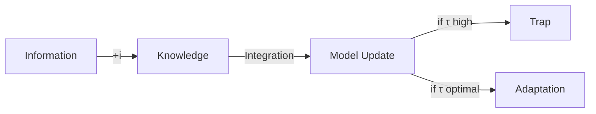

# [[09-18|25-09-18]]
## 🐢 Introduction - Grammar (현상 정의) [6 문단]

| #   | Section   | 주제문장                                                    | 핵심 개념                          | 연결 파일          |
| --- | --------- | ------------------------------------------------------- | ------------------------------ | -------------- |
| 1   | 🐢1.1     | 창업자-벤처 분리 현상이 tau 매개변수를 통해 전략적 불확실성을 주입한다               | tau as heterogeneity parameter | [[🐢1.123456]] |
| 2   | 🐢1.2     | Tesla의 낮은 tau 접근과 Better Place의 높은 tau 접근이 극명한 대조를 보여준다 | tau의 실제 사례                     | [[🐢1.123456]] |
| 3   | 🐢1.3     | 현재 경영과학 문헌은 이러한 불확실성 주입의 정량화 프레임워크가 부족하다                | 연구 gap 식별                      | [[🐢1.123456]] |
| 4   | 🐢1.4     | 베타 분포의 concentration parameter를 통해 이 분리 역학을 수학적으로 모델링한다 | 수학적 기초                         | [[🐢1.123456]] |
| 5   | 🐢1.5     | DNA-firebreak 생물학적 은유가 이 프레임워크를 직관적으로 만든다               | 은유적 이해                         | [[🐢1.123456]] |
| 6   | 🐢1.6     | 불확실성 주입을 통한 전략적 의사결정에 대한 실행 가능한 통찰을 제공한다                | 논문의 기여                         | [[🐢1.123456]] |
|     | [[🗄️🐢]] |                                                         |                                |                |
|     | [[🖼️🐢]] |                                                         |                                |                |

## 🐅 Theory & Modeling - Logic (수학적 논리) [12 문단]

### 🐅2.12🏇 Founder-Venture 분리구조 [2 문단]

| #   | Section     | 주제문장                                                                                                                                    | 핵심 개념                              | 연결 파일        |
| --- | ----------- | --------------------------------------------------------------------------------------------------------------------------------------- | ---------------------------------- | ------------ |
| 7   | 🐅2.1       | 창업자의 벤처 비즈니스 모델 품질관리가 tau 설정의 핵심 배경이다                                                                                                   | 제안배경                               | [[🐅2.12🏇분리연결]] |
| 8   | 🐅2.2       | tau는 action-plan, explore-exploit등을 스펙트럼상에 놓는다. beta-binomial conjugate, beta, binomial distribution설명, concentration parameterization | [[🙋‍♀️chalire_scott_noubar(tau)]] | [[🐅2.12🏇분리연결]] |
|     | [[🗄️🐢🐅]] |                                                                                                                                         |                                    |              |

### 🐅2.34🔥 Firebreak 전략 은유 [2 문단]

|#|Section|주제문장|핵심 개념|연결 파일|
|---|---|---|---|---|
|9|🐅2.3|Firebreak의 narrowness가 tau의 전략적 유연성을 은유적으로 표현한다|🧠접근: strategic ambiguity|[[🐅2.34🔥불공_C]]|
|10|🐅2.4|Exaptation possibility space가 tau의 적응 공간을 정의한다|🤜접근: adaptation space|[[🐅2.34🔥불공_C]]|

### 🐅2.56🧬 DNA 구조 은유 [2 문단]

| #   | Section | 주제문장                                                                    | 핵심 개념         | 연결 파일            |
| --- | ------- | ----------------------------------------------------------------------- | ------------- | ---------------- |
| 11  | 🐅2.5   | DNA double strand의 꼬임 정도가 promise의 sellability와 deliverability 균형을 표현한다 | 🧠접근: 구조적 팽팽함 | [[🐅2.56🧬최무_I]] |
| 12  | 🐅2.6   | Mutation 허용 정도가 주어진 제약 하에서 tau의 진화 가능성을 결정한다                            | 🤜접근: 변이 허용도  | [[🐅2.56🧬최무_I]] |

### 🐅2.78💸 실증 방법론 [2 문단]

|#|Section|주제문장|핵심 개념|연결 파일|
|---|---|---|---|---|
|13|🐅2.7|계층모델과 잠재변수에 substantial meaning을 부여하는 방식이 실증의 핵심이다|방법론적 기초|[[🐅2.78🐣알까실증]]|
|14|🐅2.8|Essential heterogeneity는 founder-venture의 group-individual 구조로 진화한다|계층적 변동|[[🐅2.78🐣알까실증]]|

### 🐅2.91011112 성공확률 인식 진화 [4 문단]

| #   | Section              | 주제문장                                                 | 핵심 개념  | 연결 파일            |
| --- | -------------------- | ---------------------------------------------------- | ------ | ---------------- |
| 15  | 🐅2.9                | 창업가 인식이 monotonic에서 concave로 진화한다                    | M1→M1' | [[🐅2.91011112]] |
| 16  | 🐅2.10               | Concave 인식이 random variable로 확장된다                    | M1'→M2 | [[🐅2.91011112]] |
| 17  | 🐅2.11               | Random variable이 approximated random variable로 실용화된다 | M2→M2' | [[🐅2.91011112]] |
| 18  | 🐅2.12               | 정보 통합 비용이 학습 능력과 tau의 관계를 매개한다                       | ic의 역할 | [[🐅2.91011112]] |
|     | [[🗄️🐅]]            |                                                      |        |                  |
|     | [[🖼️🐅(M1234).svg]] |                                                      |        |                  |

## 🐙 Application - Rhetoric (설득적 사례) [6 문단]

| #   | Section | 주제문장                                                                                                 | 핵심 개념    | 연결 파일          |
| --- | ------- | ---------------------------------------------------------------------------------------------------- | -------- | -------------- |
| 19  | 🐙3.1   | Better Place와 Tesla의 M1'→M2 전환이 concave에서 random variable로의 진화를 보여준다                                 | 실증 사례 1  | [[🐙3.123456]] |
| 20  | 🐙3.2   | M2' 기준에서 두 기업의 approximation 전략이 극명하게 대조된다                                                           | 실증 사례 2  | [[🐙3.123456]] |
| 21  | 🐙3.3   | Complexity 관리 측면에서 Tesla의 낮은 tau가 우위를 보였다                                                            | 복잡성 관리   | [[🐙3.123456]] |
| 22  | 🐙3.4   | c_t < c_b이고 i_t < i_b여서 tau__t > tau__b. Tesla는 높은 tau_로 유연했으나, Better Place는 낮은 tau_에도 정밀 약속 고수로 실패 | 정보 통합 비용 | [[🐙3.123456]] |
| 23  | 🐙3.5   | tau* = max(0, V/ic - 1) 공식이 최적 불확실성 수준을 정의한다                                                         | 최적화 공식   | [[🐙3.123456]] |
| 24  | 🐙3.6   | Founders의 "prediction-based prescription" 패턴이 tau 선택을 예측한다                                           | 경험적 예측   | [[🐙3.123456]] |

## 👾 Conclusion - 확장과 함의 [8 문단]

### 👾4.1🏇 Founder-Venture 분리의 함의 [2 문단] (← 🐅2.12🏇 확장)

|#|Section|주제문장|핵심 개념|연결 파일|확장원|
|---|---|---|---|---|---|
|25|👾4.1.1|Partial pooling의 "study variation" 효과가 tau 매개변수의 이론적 기초를 제공한다|McElreath 연결|[[👾4.1🏇분리연결]]|🐅2.12|
|26|👾4.1.2|Action school(no pooling)과 planning school(full pooling)의 중간지점이 최적이다|학파 통합|[[👾4.1🏇분리연결]]|🐅2.12|

### 👾4.2🔥 전략적 모호성의 가치 [2 문단] (← 🐅2.34🔥 확장)

|#|Section|주제문장|핵심 개념|연결 파일|확장원|
|---|---|---|---|---|---|
|27|👾4.2.1|Strategic ambiguity가 정보 통합 비용을 낮춰 학습을 촉진한다|모호성의 가치|[[👾4.2🔥불공_C]]|🐅2.34|
|28|👾4.2.2|Firebreak의 폭이 적응 공간의 크기를 결정한다|적응 유연성|[[👾4.2🔥불공_C]]|🐅2.34|

### 👾4.3🧬 Cleverly Brute Force 전략 [2 문단] (← 🐅2.56🧬 확장)

|#|Section|주제문장|핵심 개념|연결 파일|확장원|
|---|---|---|---|---|---|
|29|👾4.3.1|Rejection option과 probability space 제한이 높은 tau의 위험을 완화한다|리스크 관리|[[👾4.3🧬최적무지]]|🐅2.56|
|30|👾4.3.2|Camuffo(2024)의 실험이 제한된 탐색의 효과성을 입증한다|실증 근거|[[👾4.3🧬최적무지]]|🐅2.56|

### 👾4.4💸 미래 연구 방향 [2 문단] (← 🐅2.78💸 확장)

|#|Section|주제문장|핵심 개념|연결 파일|확장원|
|---|---|---|---|---|---|
|31|👾4.4.1|Hierarchical Bayes 방법론이 tau 추정의 새로운 가능성을 연다|방법론적 확장|[[👾4.4🐣알까실증]]|🐅2.78|
|32|👾4.4.2|Equity valuation 연구와의 통합이 실무적 적용을 강화한다|실무 연결|[[👾4.4🐣알까실증]]|🐅2.78|

---
# [[09-17|25-09-17]]

# 🎹 약속설계의 음계: Entrepreneurial Promise as Bayesian Adaptation

## Paper Structure: 32 Paragraphs in 4 Sections

### 🐢 Introduction - Grammar (현상 정의) [6 paragraphs]

| # | Section | Main Message | Key Concepts | Evidence/Examples | Figures/Tables |
|---|---------|--------------|--------------|-------------------|----------------|
| 1 | 🐢1.1 | Tesla and Better Place shared identical visions of electrifying automobiles, yet diverged due to tau approaches | Same vision, different fate | Tesla adaptive tau vs BP rigid tau | Fig: Company trajectories |
| 2 | 🐢1.2 | τ* = max(0, 1/(ic) - 1) with three meanings: tightness, samples, width | Core equation | 4 interpretations of tau | Table: Tau meanings |
| 3 | 🐢1.3 | DNA tension and firebreak width metaphors explain flexibility-efficiency tradeoff | Biological & strategic metaphors | DNA mutation, firebreak containment | Fig: Metaphors |
| 4 | 🐢1.4 | Founder-venture separation enables simulation and calibration via HBM | Methodological innovation | Principal-agent, hierarchical Bayes | Fig: Separation model |
| 5 | 🐢1.5 | Framework bridges action school (τ→0) and planning school (τ→∞) | Theoretical contribution | False dichotomy resolution | Table: School comparison |
| 6 | 🐢1.6 | Paper follows what-why-how-so what structure across 4 sections | Roadmap | 🐢🐅🐙👾 structure | Fig: Paper structure |

### 🐅 Theory & Modeling - Logic (수학적 논리) [12 paragraphs]

#### 🐅2.12🏇 Founder-Venture Separation [2 paragraphs]
| # | Section | Main Message | Key Concepts | Evidence | Figures |
|---|---------|--------------|--------------|----------|---------|
| 7 | 🐅2.1 | Founders' business model quality control through tau is undertheorized capability | Theoretical background | Quality control literature | - |
| 8 | 🐅2.2 | Beta-binomial conjugate unifies action-planning spectrum | Mathematical foundation | Beta(μ,τ) structure | Fig: Beta distributions |

#### 🐅2.34🔥 Firebreak Strategy [2 paragraphs]
| # | Section | Main Message | Key Concepts | Evidence | Figures |
|---|---------|--------------|--------------|----------|---------|
| 9 | 🐅2.3 | Firebreak width expresses strategic flexibility metaphorically | Strategic ambiguity | Containment vs contraction | Fig: Firebreak strategies |
| 10 | 🐅2.4 | Exaptation space defines adaptation possibilities | Adaptation space | Slack's 15 pivots | - |

#### 🐅2.56🧬 DNA Structure [2 paragraphs]
| # | Section | Main Message | Key Concepts | Evidence | Figures |
|---|---------|--------------|--------------|----------|---------|
| 11 | 🐅2.5 | DNA tightness balances sellability-deliverability | Structural tension | Replication fidelity | Fig: DNA tightness |
| 12 | 🐅2.6 | Mutation tolerance determines evolutionary possibility | Variation tolerance | Evolutionary constraints | - |

#### 🐅2.78💸 Empirical Methodology [2 paragraphs]
| # | Section | Main Message | Key Concepts | Evidence | Figures |
|---|---------|--------------|--------------|----------|---------|
| 13 | 🐅2.7 | Substantial meaning to latent variables enables identification | Methodological foundation | Hierarchical Bayes | - |
| 14 | 🐅2.8 | Essential heterogeneity evolves through hierarchical structure | Hierarchical variation | Group-individual effects | Fig: Hierarchy |

#### 🐅2.91011112 Model Evolution [4 paragraphs]
| # | Section | Main Message | Key Concepts | Evidence | Figures |
|---|---------|--------------|--------------|----------|---------|
| 15 | 🐅2.9 | M1→M1': Monotonic to concave perception with complexity | Model evolution 1 | φ* = 1/(c+1) | Fig: M1→M1' |
| 16 | 🐅2.10 | M1'→M2: Concave to random variable thinking | Model evolution 2 | φ ~ Beta(μ,τ) | Fig: M1'→M2 |
| 17 | 🐅2.11 | M2→M2': Random to approximated implementation | Model evolution 3 | Sample-based MCMC | Fig: M2→M2' |
| 18 | 🐅2.12 | Information integration cost mediates tau-learning relationship | Integration cost | i = understanding cost | Table: Cost factors |

### 🐙 Application - Rhetoric (설득적 사례) [6 paragraphs]

| # | Section | Main Message | Key Concepts | Evidence | Figures/Tables |
|---|---------|--------------|--------------|----------|----------------|
| 19 | 🐙3.1 | BP and Tesla demonstrate M1'→M2 evolution differently | Case comparison 1 | BP stuck at M1', Tesla at M2 | Table: Comparison |
| 20 | 🐙3.2 | M2' reveals stark approximation strategy contrast | Case comparison 2 | Adaptive vs rigid tau | Fig: Tau paths |
| 21 | 🐙3.3 | Tesla's complexity reduction enabled flexibility | Complexity management | 5 vs 15 subsystems | Table: Complexity |
| 22 | 🐙3.4 | Despite higher optimal tau, Tesla stayed flexible while BP stayed rigid | Integration paradox | 270 vs 700 employees | Fig: i-c-tau |
| 23 | 🐙3.5 | τ* = max(0, V/ic - 1) defines optimal uncertainty | Optimization formula | Mathematical derivation | Table: Calculation |
| 24 | 🐙3.6 | "Prediction-based prescription" predicts success | Empirical pattern | Pitch analysis data | Fig: Correlation |

### 👾 Conclusion - 확장과 함의 [8 paragraphs]

#### 👾4.1🏇 Separation Implications [2 paragraphs]
| # | Section | Main Message | Key Concepts | Evidence | Figures |
|---|---------|--------------|--------------|----------|---------|
| 25 | 👾4.1.1 | Partial pooling provides tau's theoretical foundation | Statistical theory | McElreath's framework | - |
| 26 | 👾4.1.2 | Optimal point between action and planning schools | School synthesis | Pooling spectrum | Fig: Spectrum |

#### 👾4.2🔥 Strategic Ambiguity Value [2 paragraphs]
| # | Section | Main Message | Key Concepts | Evidence | Figures |
|---|---------|--------------|--------------|----------|---------|
| 27 | 👾4.2.1 | Strategic ambiguity facilitates learning | Ambiguity value | Delayed convergence benefits | - |
| 28 | 👾4.2.2 | Firebreak width determines pivot capacity | Adaptation flexibility | Strategic options | - |

#### 👾4.3🧬 Cleverly Brute Force [2 paragraphs]
| # | Section | Main Message | Key Concepts | Evidence | Figures |
|---|---------|--------------|--------------|----------|---------|
| 29 | 👾4.3.1 | Rejection options mitigate high-tau risks | Risk management | Bounded search strategy | - |
| 30 | 👾4.3.2 | Camuffo's experiments validate constrained search | Empirical validation | RCT results 2024 | - |

#### 👾4.4💸 Future Research [2 paragraphs]
| # | Section | Main Message | Key Concepts | Evidence | Figures |
|---|---------|--------------|--------------|----------|---------|
| 31 | 👾4.4.1 | Hierarchical Bayes opens tau estimation possibilities | Methodological extension | Bayesian workflow | - |
| 32 | 👾4.4.2 | Equity valuation integration strengthens practice | Practice connection | VC applications | - |

---

## Core Architecture

### 🌲 Three Contributions
1. **SEPARATION**: Founder ≠ Venture (simulation/calibration enabled)
2. **DOUBLE REPARAMETERIZATION**: Success → Promise (φ) → Aspiration (μ) + Concentration (τ)
3. **BRIDGING**: Action ↔ Planning via rational ignorance

### 📊 Model Evolution Matrix

| Model | Type | Reparameterization | Uncertainty Addition | Key Insight |
|:---:|:---:|:---|:---|:---|
| **M1** | Base | Success → Promise (φ) | - | Promise mediates success |
| **M1'** | +Nature | Success → Promise (φ) | c (complexity) | φ* = 1/(c+1) |
| **M2** | Base | Promise → Aspiration (μ) | - | Promise has distribution |
| **M2'** | +Founder | Promise → Aspiration (μ) | τ (concentration) | Learning trap vs Rational ignorance |

### 🎯 Key Formula
**τ* = max(0, V/(i×c) - 1)**
- V: Venture value
- i: Information integration cost
- c: Environmental complexity

### 💡 Core Prescription
"Earn your precision by adding samples under controlled information integration cost and complexity"

---

## Figure List

1. **🐢 Introduction Figures**
   - Company trajectories (Tesla vs Better Place)
   - DNA & Firebreak metaphors
   - Founder-venture separation model
   - Paper structure diagram

2. **🐅 Theory Figures**
   - Beta distributions comparison
   - Firebreak strategies
   - DNA tightness illustration
   - Hierarchical structure
   - Model evolution M1→M1'→M2→M2'

3. **🐙 Application Figures**
   - Tau evolution paths
   - i-c-tau relationship
   - Success correlation patterns

4. **👾 Conclusion Figures**
   - Pooling spectrum

## Table List

1. **🐢 Introduction Tables**
   - Four meanings of tau
   - School comparison

2. **🐅 Theory Tables**
   - Integration cost factors

3. **🐙 Application Tables**
   - Company comparison
   - Complexity metrics
   - Optimal tau calculation

---

## Reading Guide

### For Theorists
Focus on sections 7-18 (🐅 Theory) and 25-32 (👾 Extensions)

### For Practitioners
Focus on sections 1-6 (🐢 Introduction) and 19-24 (🐙 Application)

### For Empiricists
Focus on sections 13-14 (Methodology), 19-24 (Application), and 31-32 (Future research)

---

*"The first reparameterization is a contract with nature,*
*The second reparameterization is a contract with oneself."*

---

# 🎹 약속설계의 음계: Entrepreneurial Promise as Bayesian Adaptation

[[0(약속설계)]]
Bayesian and Evolutionary entrepreneurship with double binding promise
## 논문의 3대 기여 아키텍처

### 🌲 Contribution 1: SEPARATION (분리)
**Founder ≠ Venture**: 창업가와 벤처를 분리하여 지식과 의도가 비즈니스 모델링에 미치는 영향 서술

### 🌀 Contribution 2: ENDOGENIZATION through Two Reparameterizations (두 번의 재매개변수화를 통한 내생화)
**Cascading Transformation**: 
- **First**: Success probability → Promise level (φ) + Nature's complexity (c)
- **Second**: Promise level → Aspiration level (μ) + Concentration level (τ)

### 🌉 Contribution 3: BRIDGING (가교)
**Action ↔ Planning**: 무지의 합리화를 통한 행동학파와 계획학파 연결

---

## 모델 진화: Base + Uncertainty Extension 패턴

### 📊 모델 구조 매트릭스

| 모델 | 유형 | 재매개변수화 | 불확실성 추가 | 핵심 통찰 |
|:---:|:---:|:---|:---|:---|
| **M1** | Base | Success → Promise (φ) | - | 약속이 성공확률을 매개 |
| **M1'** | +Nature | Success → Promise (φ) | c (complexity) | φ* = 1/(c+1) |
| **M2** | Base | Promise → Aspiration (μ) | - | 약속도 분포를 가짐 |
| **M2'** | +Founder | Promise → Aspiration (μ) | τ (concentration) | Learning trap vs Rational ignorance |

---

## 4모듈 × 4감각 구조화 (M1, M1', M2, M2' 반영)

| 모듈 | 🐢낭만거북의 **철학적 탐구** | 🐅세련호랑지의 **수학적 정교화** | 🐙절절문어용의 **실증적 포착** | 👾똘똘외계현의 **통합적 지혜** |
|:---:|:---|:---|:---|:---|
| **M1** 📐Base Model 1 *Reparameterize I* | **성공의 재정의** • P(success) → P(promise) • 약속이 곧 성공의 언어 • "말이 씨가 된다" | **첫 번째 재매개변수화** • s,d ~ Bernoulli(φ) • φ ∈ [0,1]: 약속수준 • 단순 변환 모델 | **초기 스타트업의 선언** • "We will revolutionize..." • 구체성 없는 비전 • 순수한 의지의 표현 | **분리의 시작** • 창업가의 말 ≠ 벤처의 현실 • 약속이라는 인터페이스 발견 • 측정 가능한 구조 창출 |
| **M1'** 🌿Extended 1 *+Nature's Uncertainty* | **자연의 개입** • 복잡성이 약속을 제약 • "Man proposes, God disposes" • 겸손의 필요성 | **자연 불확실성 추가** • φ* = 1/(c+1) • c: 운영 복잡도 • **Proposition 1** 도출 | **Better Place의 교훈** • c=∞에서 φ=1 선택 • "정확히 5분" → $850M 손실 • 자연을 무시한 대가 | **첫 번째 지혜** • 복잡할수록 보수적으로 • 자연은 통제 불가능 • Reliability engineering 원리 |
| **M2** 📈Base Model 2 *Reparameterize II* | **약속의 약속** • 메타 레벨 상승 • "나는 얼마나 약속할 것인가" • 열망의 도입 | **두 번째 재매개변수화** • φ ~ Beta(μ,τ) • μ: 열망수준 • 분포적 사고 시작 | **산업별 패턴 관찰** • Biotech: 높은 열망 • Software: 적응적 열망 • 생태계의 영향 | **계층적 사고** • Promise about promise • 불확실성의 불확실성 • Hierarchical Bayes 구조 |
| **M2'** 🎯Extended 2 *+Founder's Uncertainty* | **의도적 무지** • Rational ignorance • "모르는 것이 힘" • 정보 vs 지식 구별 | **창업가 불확실성 추가** • τ: 집중도 • i: 정보통합비용 • **Proposition 2a,b** 도출 | **Tesla vs Nikola** • Tesla: 적응적 τ • Nikola: τ→∞ (함정) • Slack: 15번 피봇 (τ 조절) | **최종 통합** • τ→∞: Learning trap • τ→0 조건: V↑∨i↓∨c↓ • Designed uncertainty의 가치 |

---

## 핵심 구별: 이중 불확실성 구조

### 🌍 자연의 불확실성 (M1') vs 🧠 창업가의 불확실성 (M2')

| 구분 | 자연 (M1') | 창업가 (M2') |
|:---:|:---|:---|
| **매개변수** | c (complexity) | τ (concentration) |
| **원천** | 외부 환경 | 내부 선택 |
| **통제** | ❌ 불가능 | ✅ 가능 |
| **대응** | 수용과 적응 | 설계와 조절 |
| **실패 사례** | Better Place (c 무시) | Nikola (τ=∞) |
| **성공 사례** | 모든 성공 기업 (c 인정) | Tesla (τ 조절) |

---

# [[🐅2.56🧬최무_I]]
## 정보 → 지식 전환 메커니즘

**i = Information Integration Cost**
- 새 정보 이해 비용
- 기존 모델과의 일관성 회복
- 조직 문화 업데이트 (채용 비유)

---

## 명제 체계: 2×2 구조

|         | 자연 관련                                          | 창업가 관련                                           |
| :-----: | :--------------------------------------------- | :----------------------------------------------- |
| **최적화** | **Proposition 1** φ* = 1/(c+1) *복잡도 대응*  | **Proposition 2a** τ* = f(V/i×c) *집중도 최적화* |
| **경고**  | **Corollary 1** c 무시 → 실패 *Better Place* | **Proposition 2b** τ→∞ →실패 *Better Place*  |

---

## 문헌 지도: 이중 재매개변수화의 계보

### 🔄 Reparameterization 문헌
- **Gelman & Hill (2007)**: Bayesian reparameterization for computation
- **Betancourt & Girolami (2015)**: Geometric foundations
- **이 논문**: Entrepreneurial context에서의 이중 적용

### 🎭 Endogenization 문헌  
- **Romer (1990)**: Growth theory의 내생화
- **Acemoglu (2009)**: Institution의 내생화
- **이 논문**: Success probability의 내생화

---

## 실천 가이드: Cascading Strategy

### First Cascade (M1→M1'): 자연과의 대화
1. **c 추정**: 산업 복잡도 파악
2. **φ 조정**: 1/(c+1) 규칙 적용
3. **검증**: 시장 피드백 수집

### Second Cascade (M2→M2'): 자아와의 대화
1. **τ 설정**: 초기 낮게, 후기 높게
2. **i 관리**: 정보 통합 능력 구축
3. **균형**: Learning과 Commitment 사이

---

## 혁신적 함의: 왜 두 번의 재매개변수화인가?

### 🎨 이론적 아름다움
- 각 재매개변수화가 새로운 불확실성 차원 개방
- Exaptation: 구조적 부산물이 핵심 기능으로

### 🔬 방법론적 엄밀성
- Gelman의 Bayesian workflow 충실 구현
- 계산적 편의 → 실질적 의미 획득

### 💡 실무적 통찰
- 창업가는 두 번 선택한다: φ와 τ
- 각 선택이 다른 유형의 위험 관리

- V/i×c이 오르면 τ를 올려라

---

*"첫 번째 재매개변수화는 자연과의 계약이고,*
*두 번째 재매개변수화는 자신과의 계약이다."*
*- The Double Reparameterization of Entrepreneurial Promise*