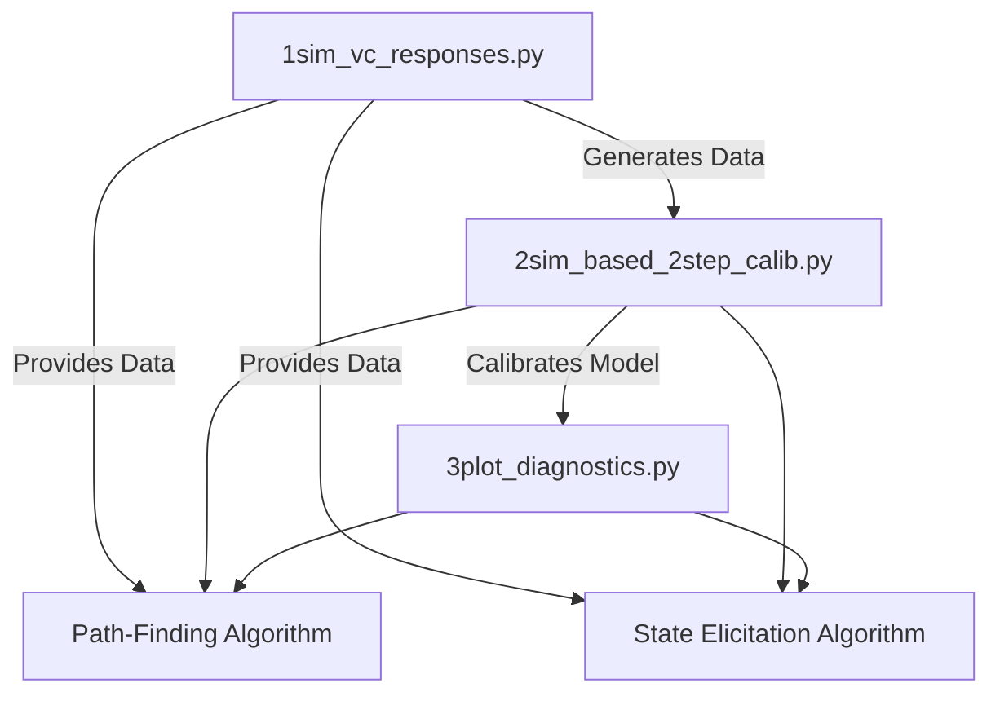

**decode-venturing** is a powerful toolkit designed to help entrepreneurs refine their startup strategies by simulating venture capitalist (VC) responses, calibrating predictive models, and visualizing key diagnostics. This project leverages AI and Bayesian statistics to align startup ideas with investor preferences, enhancing the likelihood of securing funding.

## 📚 Table of Contents

- [Overview](#overview)

- [Python Files](#python-files)

- [`1sim_vc_responses.py`](#1sim_vc_responsespy)

- [`2sim_based_2step_calib.py`](#2sim_based_2step_calibpy)

- [`3plot_diagnostics.py`](#3plot_diagnosticspy)

- [`path_finding_algorithm.py`](#path_finding_algorithmpy)

- [`state_elicitation_algorithm.py`](#state_elicitation_algorithmpy)

- [Workflow Diagram](#workflow-diagram)

- [Getting Started](#getting-started)

- [Entrepreneurial Implications](#entrepreneurial-implications)

- [Contributing](#contributing)

- [License](#license)

- [Contact](#contact)

## 🚀 Overview

**decode-venturing** streamlines the process of aligning startup ideas with VC investment criteria through:


1. **Startup Generation:** Creating detailed startup descriptions.

2. **VC Simulation:** Mimicking VC evaluations based on their investment philosophies.

3. **Model Calibration:** Understanding the factors influencing investment decisions.

4. **Diagnostics Visualization:** Assessing model performance.

5. **Strategic Optimization:** Refining strategies to increase investment success.

  

---

  

## 🛠️ Python Files

  

### `1sim_vc_responses.py`

  

```python

"""

1sim_vc_responses.py

- Generates startup descriptions from 'VC Design Grid.csv' using OpenAI API.

- Computes embeddings and cosine similarities for analysis.

- Simulates VC responses and saves results to CSV files.

"""

```

  

| **Input/Output** | **File Name** | **Path** | **Type** | **Description** |
|------------------|-----------------------------------|--------------------------------------------|----------|---------------------------------------------------------------|

| **Input** | `VC Design Grid.csv` | `decode-venturing/VC Design Grid.csv` | Input (CSV) | Templates with startup scenario parameters |

| **Input** | `Pmarca Blog Archives.pdf` | `decode-venturing/Pmarca Blog Archives.pdf`| Input (PDF) | Marc Andreessen's investment philosophy |

| **Input** | `bill gurley.md` | `decode-venturing/bill gurley.md` | Input (MD) | Bill Gurley's investment approach |

| **Output** | `embeddings.csv` | `decode-venturing/embeddings.csv` | Output (CSV) | Vector representations of startup descriptions |

| **Output** | `cosine_similarity.csv` | `decode-venturing/cosine_similarity.csv` | Output (CSV) | Similarity matrix between startups |

| **Output** | `vc_investor_responses.csv` | `decode-venturing/vc_investor_responses.csv`| Output (CSV) | VC investment decisions and reasoning |

  

---

  

### `2sim_based_2step_calib.py`

  

```python

"""

2sim_based_2step_calib.py

- Reads VC responses from 'vc_investor_responses.csv'.

- Prepares data for a two-step Stan model.

- Fits the Stan model and saves posterior distributions.

"""

```

  

| **Input/Output** | **File Name** | **Path** | **Type** | **Description** |

|------------------|-------------------------------|--------------------------------------------|----------|---------------------------------------------------------------|

| **Input** | `vc_investor_responses.csv` | `decode-venturing/vc_investor_responses.csv`| Input (CSV) | Data on VC investment decisions |

| **Input** | `two_step_model.stan` | `decode-venturing/stan/two_step_model.stan`| Input (Stan)| Bayesian model specification |

| **Output** | `two_step_stan_output.csv` | `decode-venturing/two_step_stan_output.csv`| Output (CSV)| Posterior distributions from Stan calibration |

  

---

  

### `3plot_diagnostics.py`

  

```python

"""

3plot_diagnostics.py

- Loads investment data and Stan calibration results.

- Generates calibration scatter plots and heatmaps.

"""

```

  

| **Input/Output** | **File Name** | **Path** | **Type** | **Description** |

|------------------|-----------------------------|--------------------------------------------|----------|---------------------------------------------------------------|

| **Input** | `vc_investor_responses.csv` | `decode-venturing/vc_investor_responses.csv`| Input (CSV) | VC investment decisions data |

| **Input** | `two_step_stan_output.csv` | `decode-venturing/two_step_stan_output.csv`| Input (CSV)| Calibration results from Stan model |

| **Output** | `calibration_plot.png` | Generated during runtime | Output (PNG)| Scatter plot of predicted vs actual investment probabilities |

| **Output** | `heatmap_plot.png` | Generated during runtime | Output (PNG)| Heatmap of investment probabilities by scores |

  

---

  

### `alg1_find_path.py`

  

```python

"""

path_finding_algorithm.py

- Implements the Path-Finding Algorithm (Local Search) to optimize startup strategies.

- Iteratively generates startups, simulates VC responses, calibrates models, plots diagnostics, and adjusts strategies based on insights.

"""

```

  

| **Input/Output** | **File Name** | **Path** | **Type** | **Description** |

|------------------|---------------------------------|--------------------------------------------|----------|---------------------------------------------------------------|

| **Input** | `1sim_vc_responses.py` | `decode-venturing/1sim_vc_responses.py` | Input (Python) | Data generation and simulation script |

| **Input** | `2sim_based_2step_calib.py` | `decode-venturing/2sim_based_2step_calib.py`| Input (Python) | Model calibration script |

| **Input** | `3plot_diagnostics.py` | `decode-venturing/3plot_diagnostics.py` | Input (Python) | Diagnostic plotting script |

| **Output** | Various CSV and PNG files | `decode-venturing/` | Output (CSV/PNG)| Generated data and diagnostic plots |

  

**Functionality:**

  

- **Iterative Optimization:** Continuously refine startup strategies based on simulated VC feedback and calibration insights.

- **Strategy Adjustment:** Modify startup parameters to enhance alignment with VC preferences.

  

---

  

### `alg2_elicit_state.py`

  

```python

"""

state_elicitation_algorithm.py

- Implements the State Elicitation Algorithm (Pattern Recognition) to uncover latent VC preferences.

- Generates startups, simulates VC responses, calibrates models to identify latent states, analyzes patterns, updates policies, and visualizes diagnostics.

"""

```

  

| **Input/Output** | **File Name** | **Path** | **Type** | **Description** |

|------------------|------------------------------------|--------------------------------------------|----------|---------------------------------------------------------------|

| **Input** | `1sim_vc_responses.py` | `decode-venturing/1sim_vc_responses.py` | Input (Python) | Data generation and simulation script |

| **Input** | `2sim_based_2step_calib.py` | `decode-venturing/2sim_based_2step_calib.py`| Input (Python) | Model calibration script |

| **Input** | `3plot_diagnostics.py` | `decode-venturing/3plot_diagnostics.py` | Input (Python) | Diagnostic plotting script |

| **Output** | Various CSV and PNG files | `decode-venturing/` | Output (CSV/PNG)| Generated data and diagnostic plots |

  

**Functionality:**

  

- **Latent State Identification:** Discover hidden patterns in VC responses to understand underlying investment factors.

- **Policy Updating:** Adjust startup strategies based on identified latent states to better align with VC preferences.

  

---

  

## 📈 Workflow Diagram

  



  

---

  

## 🏁 Getting Started

  

1. **Clone the Repository:**

```bash

git clone https://github.com/yourusername/decode-venturing.git

cd decode-venturing

```

  

2. **Install Dependencies:**

```bash

pip install -r requirements.txt

```

  

3. **Set Up Environment Variables:**

- Create a `.env` file in the root directory.

- Add your OpenAI API key:

```

OPENAI_API_KEY=your_openai_api_key_here

```

  

4. **Prepare Input Files:**

- Place `VC Design Grid.csv`, `Pmarca Blog Archives.pdf`, and `bill gurley.md` in the project root.

  🚨add more comments to what each means🚨

5. **Run Algorithms:**

- **Path-Finding Algorithm:**

```bash

python3 path_finding_algorithm.py

```

- **State Elicitation Algorithm:**

```bash

python3 state_elicitation_algorithm.py

```

  

6. **View Outputs:**

- Check generated CSV files and diagnostic plots in the `decode-venturing/` directory.

---

## 💡 Entrepreneurial Implications

  

- **Refine Strategies:** Iteratively adjust startup ideas based on simulated VC feedback to better align with investor preferences.

- **Understand VC Preferences:** Uncover hidden factors that drive investment decisions, enabling more targeted pitches.

- **Data-Driven Decisions:** Utilize robust statistical models and visual diagnostics to inform strategic choices and enhance investment prospects.

- **Optimize Pathways:** Continuously improve the pathway to securing investments through informed strategy adjustments.

  

---