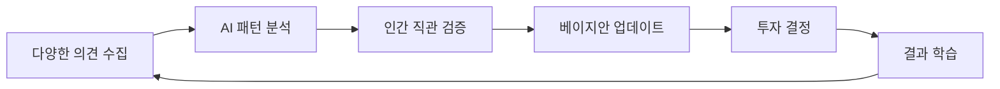

# 대안 구성 예시: G장조 버전 (성장과 기회 중심)

## 🟪 Alert (숨겨진 기회의 발견)

### A: 세계 최고 투자자들의 비밀 
**발견:** 워런 버핏과 찰리 멍거, 피터 틸과 마크 앤드리슨 - 이들의 공통점은 파트너와 **정반대 의견**을 가진다는 것이다.

### A1: 의견 충돌이 만든 유니콘들
- **Airbnb**: "누가 낯선 사람 집에 묵겠어?" vs "새로운 여행 문화가 온다"
- **Uber**: "규제에 막힐 것" vs "규제가 바뀔 것"
- **Tesla**: "자동차 산업은 너무 어려워" vs "자동차를 재정의하자"

### A2: 한국의 숨은 보석들
최근 3년간 가장 성공한 한국 스타트업 10곳 분석:
- 7곳이 초기 투자위원회에서 **찬반 의견 팽팽**
- 3곳만 만장일치로 투자 결정
⭐️ 의견이 갈린 곳의 평균 수익률이 3배 높음

## ♻️ Dig (기회를 놓치는 이유)

### D: 우리가 몰랐던 투자의 진실
**"합의는 혁신의 적이다"** - 하워드 막스

### D1: 직관 vs 데이터의 잘못된 이분법
실제로는 둘 다 필요하다:
```
최적 의사결정 = 0.4 × 직관 + 0.4 × 데이터 + 0.2 × 타이밍
```

### D2: 성공한 투자자들의 사고 패턴
1. **Pattern Recognition**: 보이지 않는 연결고리 발견
2. **Contrarian Thinking**: 남들과 다른 각도에서 보기
3. **Future Pull**: 미래에서 현재를 거꾸로 생각하기

## 🟧 Grow (새로운 투자 전략)

### G: AI + 인간의 시너지 모델

**🚀 The Venture Intelligence System**



### G1: 실시간 시장 신호 포착 시스템

**Signal Detection Algorithm:**
1. **Weak Signals**: 작은 변화의 조기 감지
   - SNS 트렌드 변화
   - 특허 출원 패턴
   - 인재 이동 흐름

2. **Strong Signals**: 명확한 기회 포착
   - 규제 변화 조짐
   - 대기업 전략 전환
   - 소비자 행동 급변

### G2: 스마트 포트폴리오 구성 전략

**"Barbell Strategy" for K-VC:**
```
포트폴리오 = 80% 안정적 성장 + 20% 문샷 프로젝트
```

- **안정적 성장 (80%)**:
  - 검증된 비즈니스 모델
  - 명확한 수익 경로
  - 의견 일치도 높음

- **문샷 프로젝트 (20%)**:
  - 파괴적 혁신 가능성
  - 의견 불일치 큼
  - 실패해도 배움이 큰 것

## 🔴 Core (실전 성공 전략)

### C: 넥스트 유니콘을 찾는 공식

**🎯 The Unicorn Formula:**
```
투자 매력도 = (시장 크기 × 팀 역량 × 타이밍) ^ 의견분산도
```

의견이 갈릴수록 잠재 수익률 증가!

### C1: 즉시 실행 가능한 5가지 전략

**1. Monday Morning Meeting**
- 매주 월요일 "Crazy Idea Session"
- 제일 엉뚱한 아이디어에 상금

**2. Reverse Pitch Day**
- 투자자가 창업자에게 피칭
- "왜 이 아이디어가 실패할 수 없는가?"

**3. Junior Partner Power**
- 주니어의 반대 의견에 2배 가중치
- 신선한 시각이 혁신을 발견

**4. Global Partner Network**
- 해외 VC와 의견 교환
- 다른 시장의 성공 사례 학습

**5. Failure Celebration**
- 분기별 "Best Failure Award"
- 실패에서 배운 점 공유

### C2: 성공 사례 만들기

**🌟 Case Study Template:**

**[회사명]의 성장 스토리**
- 초기 의견: 찬성 40% vs 반대 60%
- 반대 이유: [구체적 우려사항]
- 전환점: [무엇이 바뀌었나]
- 현재 가치: [얼마나 성장했나]
- 핵심 교훈: [무엇을 배웠나]

### C12: 2025년을 위한 액션 플랜

**Q1: Foundation (기초 다지기)**
- [ ] 팀별 베이지안 사고 워크샵
- [ ] AI 투자 분석 도구 도입
- [ ] 의견 다양성 측정 시작

**Q2: Experimentation (실험하기)**
- [ ] 파일럿 프로젝트 3개 선정
- [ ] A/B 테스트 투자 의사결정
- [ ] 주니어 주도 투자 1건

**Q3: Scaling (확대하기)**
- [ ] 성공 모델 전사 확산
- [ ] 글로벌 VC 파트너십
- [ ] AI 도구 고도화

**Q4: Transformation (변혁하기)**
- [ ] 새로운 투자 철학 정립
- [ ] 차세대 유니콘 발굴
- [ ] K-VC 3.0 선언

## 🎊 마무리: 가능성의 세계로

> "미래는 예측하는 것이 아니라 만드는 것이다."
> - 피터 드러커

**당신의 다음 유니콘은:**
- 지금 투자위원회에서 의견이 갈리고 있는 그 회사
- 너무 이상해서 설명하기 어려운 그 아이디어
- 주니어는 좋아하는데 시니어는 의심하는 그 팀

**🚀 지금 시작하세요:**
1. 오늘의 투자 검토 건 중 의견이 가장 갈리는 것 다시 보기
2. 반대 의견을 가진 동료와 커피 한잔
3. "만약 이게 성공한다면?" 상상해보기

**함께 만들어갈 미래:**
- 의견 불일치를 즐기는 투자 문화
- AI와 협업하는 스마트 VC
- 글로벌 유니콘을 배출하는 K-스타트업

---

**다음 스텝:** 
귀사만의 "Unicorn Divergence Score" 만들어보기
- 과거 투자 중 의견 불일치 정도와 수익률 상관관계 분석
- 가장 성공한 투자의 초기 찬반 비율 확인
- 놓친 기회들의 공통 패턴 발견

**💡 Remember:** 
*"모두가 동의하는 아이디어는 이미 늦은 아이디어다."*

**[[박건호]]**: 한국 VC의 미래를 함께 만들어갑시다! 🚀